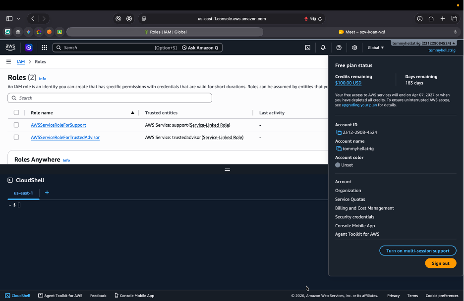
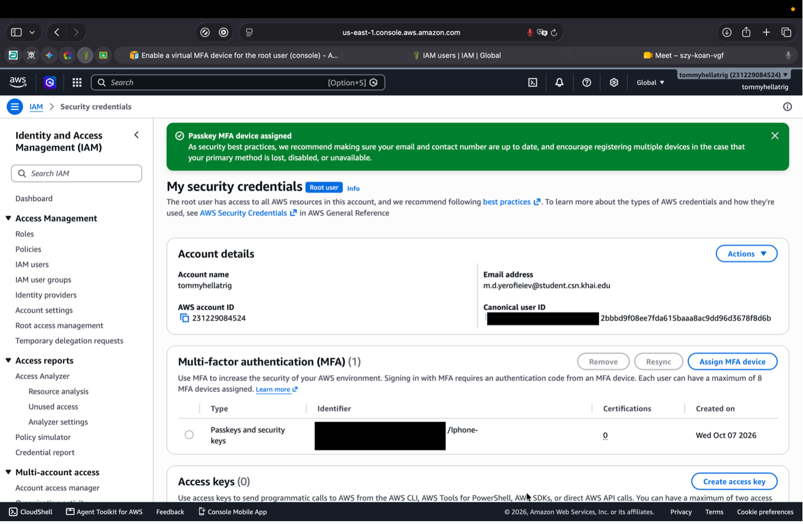
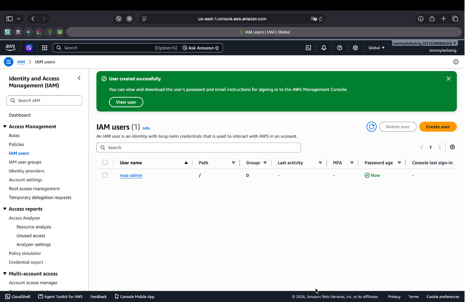
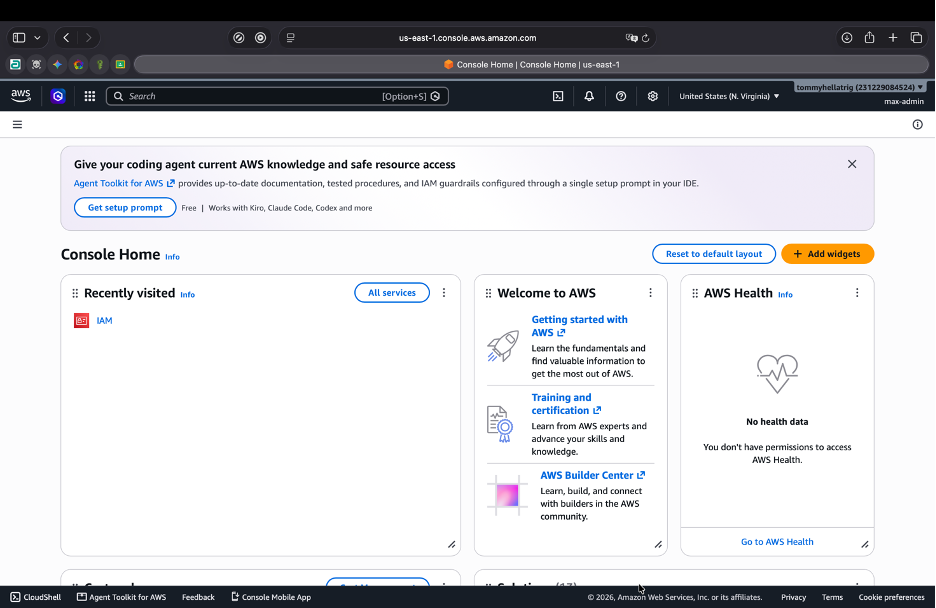
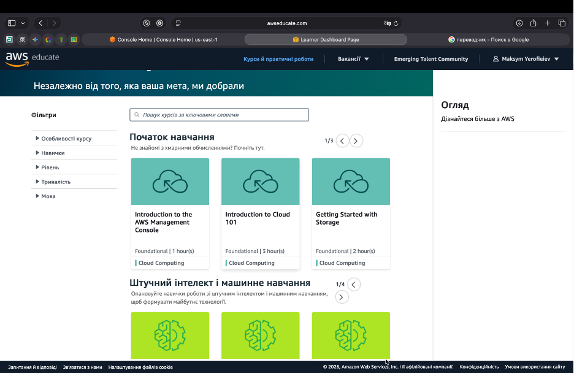
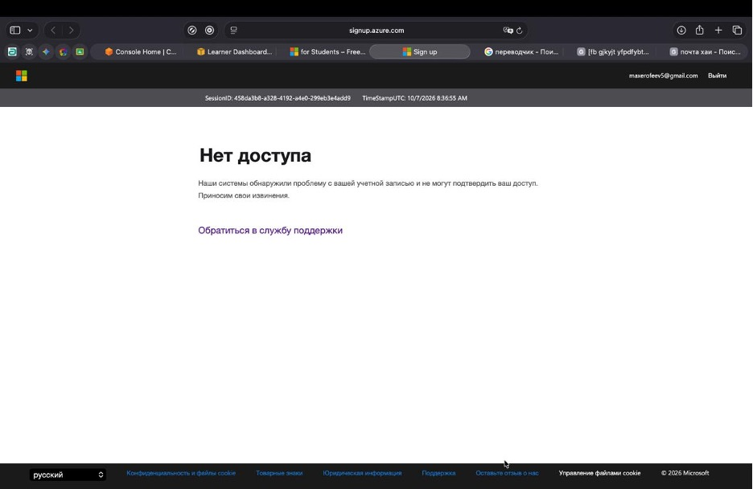
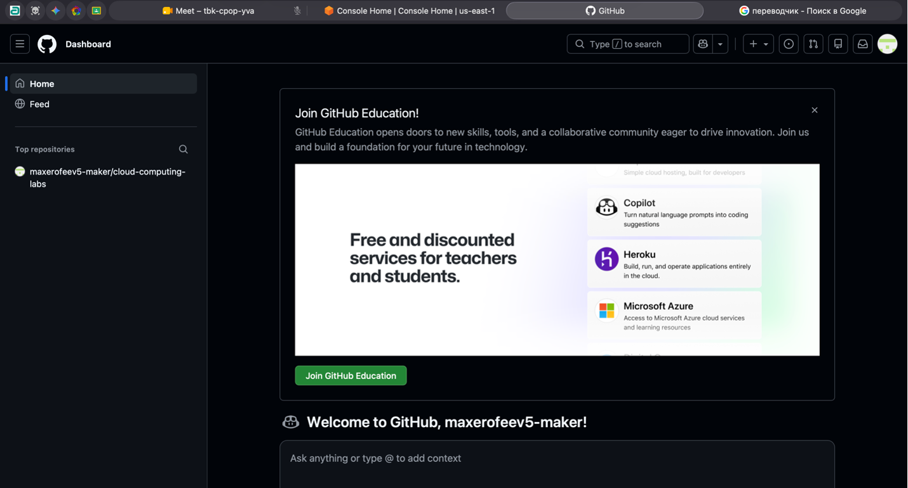

# Laboratory Work №1

## Register with Cloud Providers

**Student:** Maksym Yerofeev  
**University:** Kharkiv Aviation Institute

## Task 1 — Sign up for AWS Free Tier account

AWS Free Tier account was successfully created.

### Set MFA for AWS account root user

MFA was successfully configured for the AWS root user.

### Create an IAM admin user

An IAM administrator user was successfully created for the AWS account.

### IAM sign-in

The IAM administrator sign-in was successfully configured.

### AWS credentials

AWS IAM user credentials were successfully generated.

## Task 2 — Register with Amazon Educate

AWS Educate account was successfully registered using the university email address.

## Task 3 — Register for Microsoft Azure Free Student Account

Microsoft Azure Free Student account could not be registered due to an error during the registration process.

## Task 4 — Create GitHub Account

A GitHub account and repository were successfully created for future laboratory works.

## Conclusion

During this laboratory work, an AWS Free Tier account was successfully created and configured with MFA and an IAM administrator user. An AWS Educate account and a GitHub account were also successfully created. An attempt was made to register for a Microsoft Azure Free Student account, but the registration could not be completed due to an error during the registration process.
